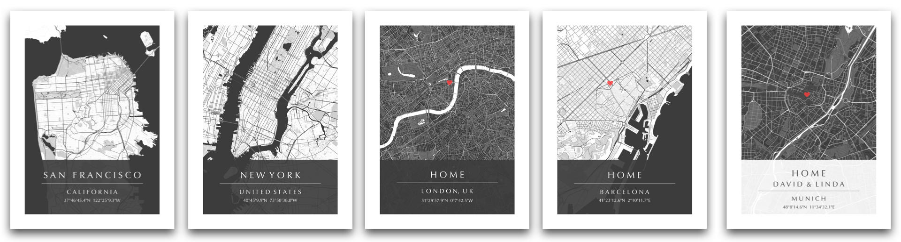

# MapPosterizer
**MapPosterizer** is a command line application for generating stylish posters of custom city maps.


## Installation
Create and activate a virtual environment using `virtualenv` (or any other tool of choice):
```bash
python -m pip install virtualenv
virtualenv venv
source venv/bin/activate
```
Install dependencies from `requirements.txt`:
```bash
python -m pip install -r requirements.txt
```

## Running
The following command will run MapPosterizer with the default location file `location.json` and create the output file `map.png` with the generated poster map:
```bash
python posterize.py
```

### Examples
In the following, we provide the respective commands for generating the city poster maps from the teaser image at the top of this page:



```bash
# San Francisco:
python posterize.py -m resources/map_style_light.json -c resources/canvas_style_dark.json -l resources/examples/location_san_francisco.json

# New York:
python posterize.py -m resources/map_style_light.json -c resources/canvas_style_dark.json -l resources/examples/location_new_york.json

# London:
python posterize.py -m resources/map_style_dark.json -c resources/canvas_style_dark.json -l resources/examples/location_london.json

# Barcelona:
python posterize.py -m resources/map_style_light.json -c resources/canvas_style_dark.json -l resources/examples/location_barcelona.json

# Munich:
python posterize.py -m resources/map_style_dark.json -c resources/canvas_style_light.json -l resources/examples/location_munich.json
```

### Custom Maps
In order to generate custom maps of arbitrary locations, you can edit the location in the file `location.json`.

You can get the map coordinates from [OpenStreetMap](https://www.openstreetmap.org/):
* Go to the OpenStreetMap export page [https://www.openstreetmap.org/export](https://www.openstreetmap.org/export).
* Below the four coordinates on the top left, click on the link for manual selection of the area of interest.
* Move the view (zoom/translate) to the desired map portion.
* Copy the four coordinates for left, top, right and bottom (and paste them into the `location.json` file).
* Optional: get the coordinates for heart-shaped pin and paste them as marker coordinates.

You may need to play around with the zoom level (13-18) in order to obtain an optimal result. To figure out a suitable zoom level, it is recommended to always start at a coarse zoom level of 13 and then increase it if the level-of-detail of the generated map is not fine enough.
By copying and modifying the json style files for map (`resources/map_style_*.json`) and canvas appearance (`resources/canvas_style_*.json`) in the `resources/` folder, you can also create completely new custom map styles.

## License
The MapPosterizer source code is licensed under the [The MIT License](https://opensource.org/licenses/MIT), please see the [LICENSE](LICENSE) file for details.

## Contact
If you have any questions, please contact [Robert Maier &lt;robert.maier@tum.de>](mailto:robert.maier@tum.de).
