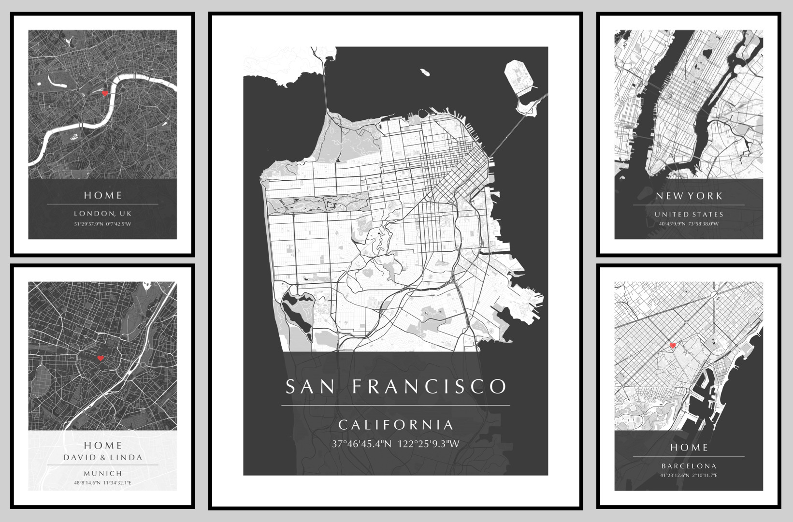

# MapPosterizer
*MapPosterizer* is a command line application for generating stylish posters of custom city maps.

## Installation
Create and activate a virtual environment using `virtualenv` (or any other tool of choice):
```bash
python -m pip install virtualenv
virtualenv venv
source venv/bin/activate
```
Install dependencies from `requirements.txt`:
```bash
python -m pip install -r requirements.txt
```

## Running
The following command will run MapPosterizer and create the output file `map.png` with the generated poster map:
```bash
python posterize.py location.json --show
```

## Examples
In the following, we provide the respective commands for generating the city poster maps from the teaser image at the top of this page:
```bash
# San Francisco:
python posterize.py -m resources/map_style_light.json -c resources/canvas_style_dark.json -l resources/examples/location_san_francisco.json

# New York:
python posterize.py -m resources/map_style_light.json -c resources/canvas_style_dark.json -l resources/examples/location_new_york.json

# London:
python posterize.py -m resources/map_style_dark.json -c resources/canvas_style_dark.json -l resources/examples/location_london.json

# Barcelona:
python posterize.py -m resources/map_style_light.json -c resources/canvas_style_dark.json -l resources/examples/location_barcelona.json

# Munich:
python posterize.py -m resources/map_style_dark.json -c resources/canvas_style_light.json -l resources/examples/location_munich.json
```

## License
The MapPosterizer source code is licensed under the [The MIT License](https://opensource.org/licenses/MIT), please see the [LICENSE](LICENSE) file for details.

## Contact
If you have any questions, please contact [Robert Maier &lt;robert.maier@tum.de>](mailto:robert.maier@tum.de).
